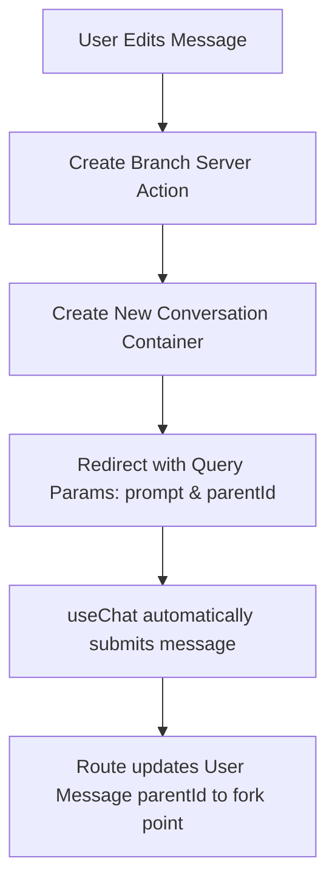

# ChaiGPT (ChatGPT Clone) - Assignment Implementation

A premium, full-stack Next.js application that implements advanced conversational capabilities modeled after OpenAI's ChatGPT. This project integrates live tool calling (Web Search via Tavily AI) and recursive, tree-based thread branching.

---

## 🛠 Key Features & Technical Implementations

### 1. Web Search Tool Integration (Vercel AI SDK v7)

- **Tool Calling Hook**: Integrated the `webSearchTool` using the Tavily Search API. When the AI agent encounters questions requiring real-time information or events past its knowledge cutoff, it automatically invokes the search tool to extract context.
- **AI SDK Compliance**: Fully upgraded to AI SDK v7 standards:
  - Migrated search tool inputs from the obsolete `parameters` property to the type-safe Zod `inputSchema`.
  - Re-mapped dynamic `UIMessage` parts on the client layer from `tool-invocation` types to dynamic `"tool-${NAME}"` parts.

### 2. Thread-Based Conversation Branching

- **Database Schema**: Leverages the self-referential `parentId` relationship on the `Message` model to represent message threads as logical trees rather than linear lists.
- **Recursive History Reconstruction**: Built `loadChatMessages` which recursively walks up parent messages across conversations to dynamically construct the complete, branched context history for any point in the tree.
- **Dynamic Branch Navigation**: Enabled message-level editing. Editing a message forks the conversation into a new thread. Sibling routes are grouped by their shared `parentId` so that users can seamlessly cycle between alternative chat branches using an `< Index / Total >` pagination pill.

---

## 🏗 System Architecture



---

## ⚙ Setup & Run Instructions

1. **Environment Variables**:
   Ensure you configure the following variables in your `.env` or `.env.local` file:

   ```env
   # Database & Auth
   DATABASE_URL="postgresql://..."
   NEXTAUTH_SECRET="..."

   # AI & Search Providers
   OPENAI_API_KEY="sk-..."
   BRAVE_SEARCH_API_KEY="bs-..."

   # RAG Vector Store
   QDRANT_URL="http://localhost:6333"
   QDRANT_COLLECTION="rag-practice"
   ```

2. **Run Development Server**:
   ```bash
   npm run dev
   ```

---

## 📝 Project Context & Disclaimer

This repository serves as a centralized hub where I manage all my development assignments.

**UI & Code Constraints Notice**:
Due to severe time constraints, I utilized AI tools to assist in generating parts of the UI elements (styles, icons, and layout structure) and bootstrapping the structural logic.

**Conceptual Background**:
While AI was used to accelerate development speed, I possess a deep and thorough understanding of the architecture. I am experienced with **Next.js** (including Server Actions, dynamic routing, and API handlers) and understand data flow throughout the code.

I have hosted thins all on my personal VPS setup with CI/CD. But somehow i recently got compomised with the implementation of this Clone project, the cause was, the clerk related packages have some loop whole or whatever it is there a but that while i have shipped this ccode to my repo, the domain is redirecting me to another website, and my keys got compromised. So i just removed all the 3rd party integrations and implemented this samll email-OTP authentication.
